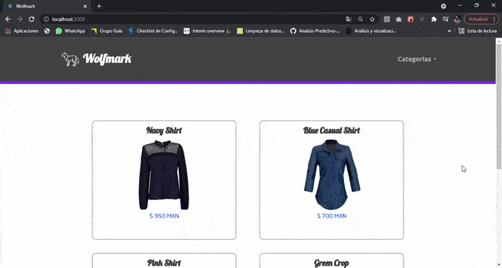

# Proyecto Wolfmak React JS - Coderhouse

Proyecto final correspondiente al curso React JS en [Coderhouse](https://www.coderhouse.com.mx/).

Este proyecto consiste en un ecommerce implementado con React, React Hooks, React Router, incluyendo librerias como React Loader Spinner, Bootstrap, por ultimo, utilizando Firebase como base de datos. 

## Librerias

Las librerias fueron incluidas en este proyecto con finalidad de estilizar el contenido.

### React Loader Spinner `react-loader-spinner`

Utilizada en la implementacion del spinner loader durante el delaay de la carga.

### Bootstrap `react-bootstrap`

Utilizada para la implementacion del proyecto en general en conjunto de los estilos descritos en el archivo `styles.css`.

## Instalación

#### Clonar el repositorio

Desde Github CLI introducir comando

`git clone https://github.com/CarolinaGutierrezS25/CursoReactJS.git`

#### Inicializacion

Una vez clonado el repositorio, nos posicionamos desde la ventana de comandos en la carpeta 

`cd path_to/CursoReactJS`

Cuando estemos posicionados en nuestra carpeta introducimos el comando

`npm install`

Tardara unos minutos en completar la instalación, seguido de esto, ejecutamos el comando start

`npm start`

Cuando el servidor comience, automáticamente va a abrir una pantalla en el navegador con la aplicación.